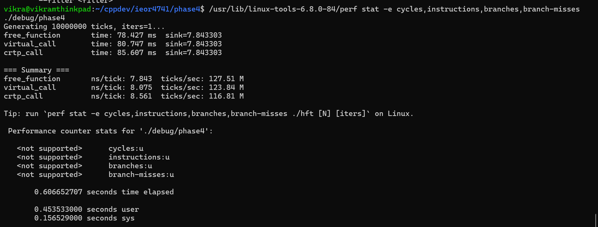
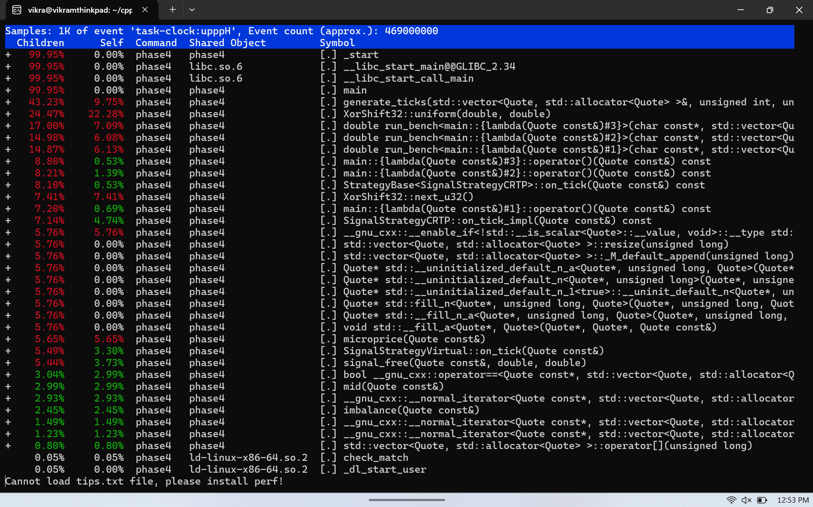

# Phase 4 Assignments

## Files
* *main_hft.cpp*: Coordinator and simulation simulator of full orderbook system
* *include/Order.h*: Implementation of internal order representation
* *include/OrderBook.h* Implementation of orderbook and matching logic of the exchange
* *main_tick.cpp*: Driver for comparing virtual and CRTP tick processing strategies
* *strategy_virtual.h*: Implementation of virtual strategies
* *stategy_crtp.h*: Implementation of CRTP protocols

## HFT System

### Summary
We implement a system which simulates 100,000 apple order signals from the 
central order book and then tries to match the internal state of the book. It 
accurately and efficiently adds new orders. Additionally it can handle 
cancel and amend signs. It will also automatically track any bids higher than
asks and behave as if the exchange clears orders until the market is resting again.

Secondarily an order manager reads the top of the book and decides to "place orders"
if the best asks and bids are close enough to the mid. We can obviously implement more
signals, but those should be tested on their own for latencies.

### Testing
I did not include all baseline code which is used for comparison, but by far
the most important change was using the correct stl containers which are optimized
for the operations each object needs. In the end, the use of smart pointers is more
important for long term development ease and long-term running safety of the program 
due to memory leaks. It will be hard to measure the downsides of raw pointers by
watching a short testing simulation.

## HFT Tick Processing: CRTP vs. Virtual Dispatch

### Summary
When running the bench normally, we actually see very atypical
results. We consistently see that virtual dispatch is outperforming
the CRTP call. In good news, the free function is consistently performing 
the best. My best guess is as to why the virtual dispatch is not demonstrating
a performance penalty is because we've only implemented one strategy. It is
possible that modern compilers are able to guess which function to use 
if you are consistently calling only one strategy. This branch prediction
then may help the virtual test on our bench perform at least equivalently to the 
CRTP call. However, I cannot figure out why its performing consistently a little 
better. Regardless, if I were to extend this bench to many strategies which is common
for most firms, we continue to expect that virtual calls will eventually start 
lagging in comparison to CRTP.

### Example Results and Profiling Output
#### Perf Details 
Unfortunately, many tools are disabled on WSL2 or I've improperly
set them up on (despite much debugging effort) with perf. 
Nevertheless, here are the results.

The report however had more to show. Consider below

Here we also wee confusing results in that much less time is spent
in the virtual on_tick implementation than in the CRTP versions.
More analysis should be done in the future to figure out why the CRTP runtime
is performing worse.

#### Conclusions
Finding the correct implementation of polymorphism is of critical 
importance for an HFT system. Given that many trading firms operate
hundreds (perhaps thousands) of strategies and signals at a given 
moment, the ability to refer to strategies abstractly is of critical 
importance for development. However, if the price of the polymorphism 
is slow runtime, you will likely lose a ton of money (which is bad!).

This analysis suggests that for small numbers of strategies, virtual dispatch
will perform better that CRTP, but no polymorphsim will be best. This violates 
at least some of our expectations and more research should be done to see how 
reproducible these findings will be at scale.
